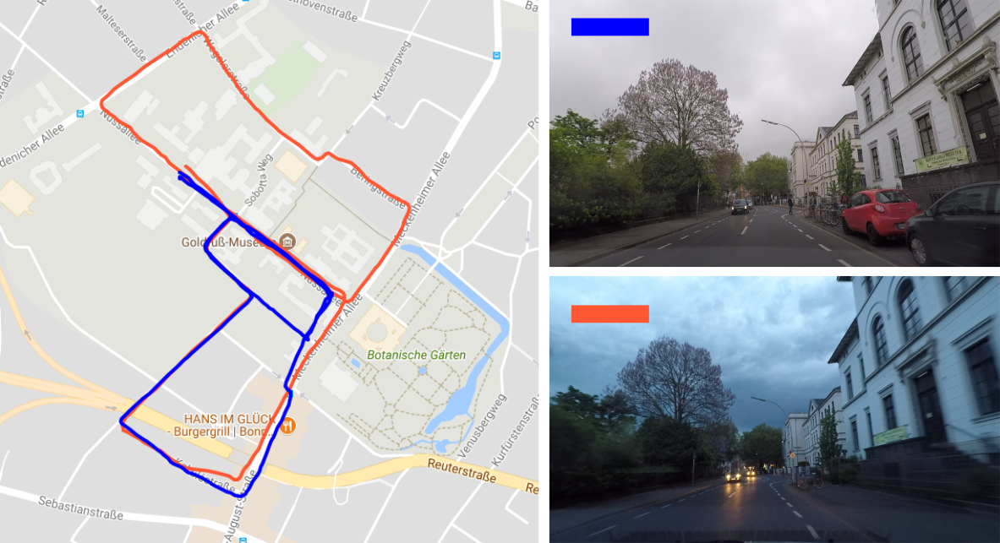

# Visual place recognition using image sequences with Relocalization

## What does this code do?
Performs matching of two image sequences of arbitrary shaped trajectories, e.g. the query trajectory may deviate from reference one. This work is an extension of our work on image sequence matching under changing visual appearances. The previous approach was dealing well with trajectories that roughly follows the same route. You can find the code by following this link [online place recognition](https://github.com/Photogrammetry-Robotics-Bonn/online_place_recognition).

In this framework, the system is able to deal with trajectories of arbitrary shapes:

* by performing relocalization step, whenever the robot is considered lost, e.g. the query trajectory deviates from the reference one.
* by taking into account the information about the similar places within reference trajectory to ensure the multiple localization hypothesis.



In Figure the images from the blue trajectory are matched against the images of orange trajectory. Blue trajectory (query) follows partially the orange trajectory (reference) as well as deviating from it. These kinds of challenges in matching images sequences are targeted in this framework. (Trajectories are plotted over Google Maps for visualization purposes. The GPS coordinates are not used for place recognition.)

For more theoretical details, please refer to our paper [Relocalization under Substantial Appearance Changes using Hashing](http://www.ipb.uni-bonn.de/wp-content/papercite-data/pdf/vysotska2017irosws.pdf).


## Installation guide

### Prerequisites

* Yaml-cpp (requires BOOST till now): `sudo apt-get install libyaml-cpp-dev libboost-all-dev`
* OpenCV: `sudo apt-get install libopencv-dev`
* Qt5: `sudo apt-get install qt5-default`
* (optional) Doxygen (generate documentation): `sudo apt-get install doxygen`


### Build
The code is tested on Ubuntu 16.04 and 18.04.
To build the project, run the following commands from the main directory:

* `mkdir build`
* `cd build`
* `cmake ..`
* `make -j4`


Additionally, you should be able to generate documentation as follows:

* `cd doc`
* `doxygen online_place_recognition.conf`

To access the documentation run `firefox html/index.html`.

If you want to build on Ubuntu 14.04, you may run into issues with yaml-cpp.


## What do I need to run this code?

* Precomputed image descriptors (features) or cost matrix
* Configuration file
* Precomputed hash table
* (optional) Estimated similar places within the reference sequence

For the examples of how to run the code please see [**RUN EXAMPLES**](examples/readme.md).


#### Feature based matching
In this mode, the program operates using **precomputed image descriptors**.
To run the matching procedure you need to provide the feature files. An example of how to run the code can be found [feature based matching example](apps/feature_based_matching). 

For details on used feature descriptors please refer to [feature description](src/features/readme.md).

**Note**: In this mode, individual features will be loaded and matched on demand. In order to be able to deal with dramatic visual changes, we typically operate with high-dimensional features and the matching procedure can take quite a long time--depending on the size and the complexity of the sequences.

#### Cost matrix based matching

For this mode, we require the **cost matrix** between two sequences to be given/precomputed. To compute the matching matrix, please see the following [estimating of a cost matrix](apps/create_cost_matrix/).

An example on how to run the matching procedure in this mode can be found [cost matrix matching example](examples/).

**Note**: This method may be used if you have rather small sequences (up to 1000 images). For bigger sequences, you may run into memory issues since the programs has to store quite a big matrix.


## How to run this code on own dataset?

### 1. Extract features
In our code, we provide  the way to use features from OverFeat and VGG-16.

To use overfeat: Go to [OverFeat Github](https://github.com/sermanet/OverFeat), follow the installation instructions and extract features using the binary as in the example:
`bin/linux_64/overfeat -f -l samples/pliers.jpg`. Store the features from individual images in the separate files.

To use VGG-16 : Go to [Keras VGG](https://keras.io/applications/) and extract features with VGG16. Store the features from individual images in the separate files.

### 2. Hash reference features 
Hash the features of reference sequence. Use [hash app](apps/hash_features) for obtaining the '.txt' file with a hash table.

### 3. (Optional) Estimate similar places within reference sequence
To improve the localization performance, you may include the notion about the similar places in the reference trajectory. Use [estimate similar places app](apps/estimate_similar_places).

### 4. Adapt the config file
Change the `config.yaml` file with your new input files.

Now, **you ready to run** the code!
Try [feature based matching](apps/feature_based_matching)! 

:grimacing: Didn't work? Leave an issue.

## Adapting the code for custom features

This framework can be adapted to matching features of the different type --- your **own features**. To use the graph matching strategy with your **own features** see the following [description](src/features/readme.md).

## Parameters
The code relies on couple of parameters. Take a look at [parameters desciption](src/tools/config_parser/parameters_readme.md) to get the best code experience.

## Related publication

Please cite the related publication, if you use the code:

```
@inproceedings{vysotska2017irosws,
	title     = {Relocalization under Substantial Appearance Changes using Hashing},
	author    = {O. Vysotska and C. Stachniss},
	booktitle = {9th Workshop on Planning, Perception and Navigation for Intelligent Vehicles at the IEEE } # IROS,
	year      = {2017},
}
```

## Troubleshooting

In case the code is not working for you or you experience some code related problems, please consider opening an issue.
